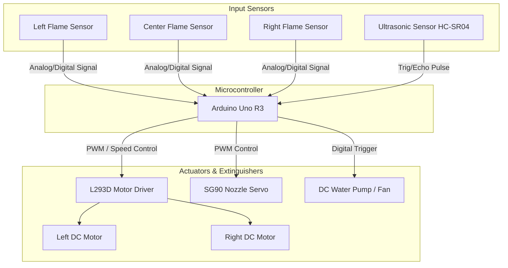
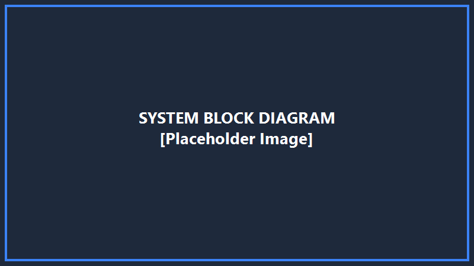
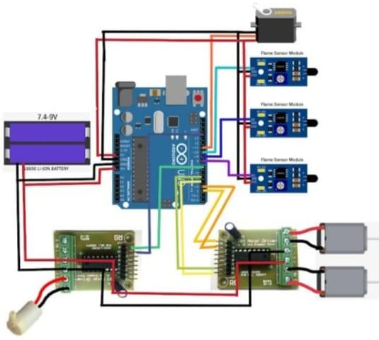
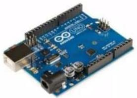
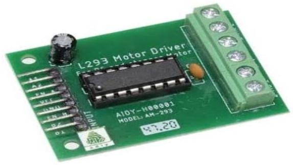
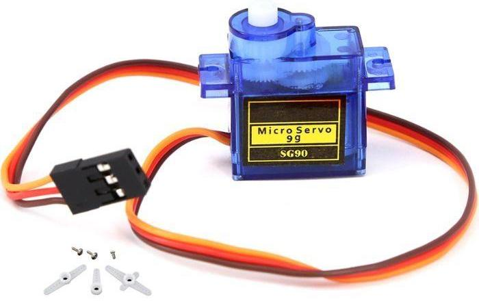
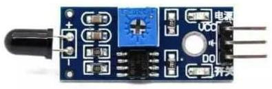
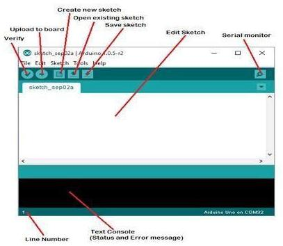
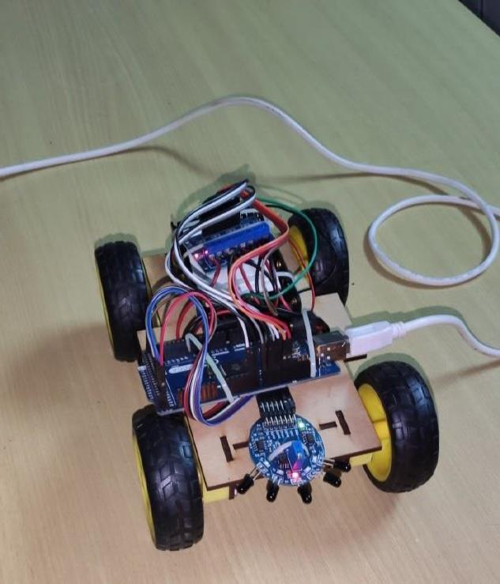
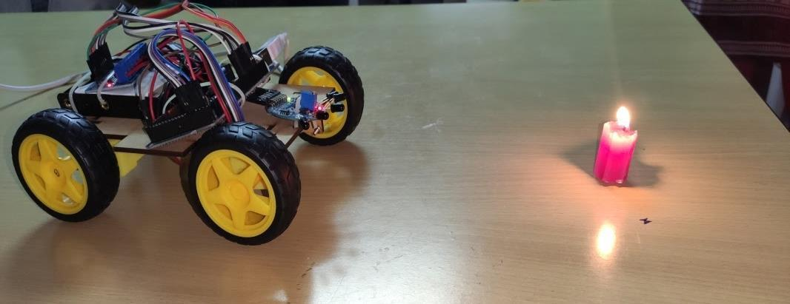

<h1 align="center">🔥 Autonomous Fire Fighting Robot 🔥</h1>

<p align="center">
  <strong>An Intelligent, Sensor-Fused Mechatronic Solution for Rapid Fire Localization & Suppression</strong>
</p>

<p align="center">
  
  
  
  
</p>

<p align="center">
  <a href="#github-statistics">
    
  </a>
  <a href="#github-statistics">
    
  </a>
  <a href="#github-statistics">
    
  </a>
  <a href="#github-statistics">
    
  </a>
</p>

---

## 📖 Table of Contents
1. [Project Overview](#-project-overview)
2. [Problem Statement & Objectives](#-problem-statement--objectives)
3. [System Features](#-system-features)
4. [System Architecture](#-system-architecture)
5. [Hardware Specifications](#%EF%B8%8F-hardware-specifications)
6. [Software & Technologies](#-software--technologies)
7. [Working Principle](#-working-principle)
8. [Project Results & Output](#-project-results--output)
9. [Block Diagram](#block-diagram)
10. [Circuit Diagram](#circuit-diagram)
11. [Hardware Setup](#hardware-setup)
12. [Robot Initialization](#robot-initialization)
13. [Fire Detection](#fire-detection)
14. [Folder Structure](#-folder-structure)
15. [Setup & Installation](#-setup--installation)
16. [Project Team & Acknowledgements](#-project-team--acknowledgements)
17. [License](#-license)

---

## 🌟 Project Overview

The **Autonomous Fire Fighting Robot** is an Electronics and Communication Engineering (ECE) STEM project developed to tackle the high-risk environments of fire hazards. The robot operates autonomously, utilizing a combination of infrared (IR) flame sensors and ultrasonic range sensors to scan, navigate, and extinguish fires in indoor or confined spaces. 

Controlled by an **Arduino Uno R3** microcontroller, the vehicle maneuvers using a dual DC motor drive system. Upon detecting a fire, it steers toward the flame, stops at a calibrated safe distance, and activates an onboard water pump and servo-controlled nozzle to extinguish the threat. This project serves as an economical and scalable prototype for industrial warehouses, residential security, and smart city emergency applications.

---

## ⚠️ Problem Statement & Objectives

### Problem Statement
Fires pose severe dangers to human life and structural integrity. Traditional firefighting relies on manual response, exposing human personnel to deadly smoke, toxic gases, extreme thermal radiation, and structural collapses. Portable extinguishers are often unreachable, and sprinkler systems are prone to mechanical faults or insufficient coverage. An autonomous, robotic first-responder can enter hazardous zones, locate the source of ignition, and neutralize it, minimizing human exposure and delays.

### Project Objectives
*   **Autonomous Fire Detection**: Instantly locate fire outbreaks in a 360-degree radius using heat and light signatures.
*   **Collision-Free Navigation**: Avoid static and dynamic obstacles using ultrasonic echo-ranging.
*   **Target Alignment**: Automatically orient and guide the chassis towards the source of ignition.
*   **Mechanical Extinguishing**: Design a compact, servo-driven water-spraying system to sweep the target area and extinguish the fire.
*   **Safety Override**: Implement fallback behaviors (reversing, scanning, halting) in case of close obstacles or system failures.

---

## ⚡ System Features

*   **3-Channel Directional Scanning**: Left, center, and right IR flame sensors provide localized triangulation of the flame source.
*   **Dual-Bridge Drive Control**: The L293D H-Bridge driver enables bidirectional control of DC motors, allowing the robot to execute sharp differential turns.
*   **Ultrasonic Obstacle Override**: Safety-first algorithm stops the robot and forces a maneuver if an obstacle is within 15 cm.
*   **Servo Sweep Spraying**: The SG90 micro-servo sweeps the water nozzle from 50° to 130° for broad, even coverage.
*   **High Performance-to-Cost Ratio**: Assembled using standard ECE components, making it accessible for rapid deployment and research.

---

## 🏗️ System Architecture

The robot integrates a hardware control loop where sensors supply environment state data to the Arduino Uno, which processes the navigation logic and triggers active motor drivers and extinguishing relays.



### Circuit & Block Layouts
<p align="center">
  
  
</p>
<p align="center">
  <em>Figure 1: High-level System Block Diagram (Left) and Wiring Circuit Diagram (Right).</em>
</p>

---

## 🛠️ Hardware Specifications

### Main Components Specifications
| Component | Key Specifications | Role in System |
| :--- | :--- | :--- |
| **Arduino Uno R3** | ATmega328P, 16 MHz, 32KB Flash, 2KB SRAM | Central processing unit; executes sensor fusion and state machine control. |
| **IR Flame Sensor (x3)** | Active LOW, adjustable comparator, 760nm–1100nm IR spectrum | Multi-directional flame detection (Left, Center, Right). |
| **Motor Driver IC L293D** | Dual H-bridge, 600mA/channel continuous, 4.5V–36V range | Drives high-current DC drive motors based on digital logic signals. |
| **Micro Servo SG90** | 180° sweep, 1.8 kg·cm torque, 9g weight, PWM driven | Rotates the water spray nozzle dynamically during fire suppression. |
| **Ultrasonic HC-SR04** | 2cm–400cm range, 15° beam angle, 5V input | Measures distance to obstacles and fire target to trigger overrides. |
| **Water Pump / Fan Motor** | 5V–12V DC operation, relay-driven | Sprays water or blows wind onto the flame source to extinguish it. |

<details>
<summary>🔍 Detailed Component Breakdown & Datasheeting</summary>

#### Arduino Uno R3
<p align="left">
  
</p>

*   **Operating Voltage**: 5V (USB or 2.1mm DC barrel jack input)
*   **Input Voltage limits**: 6-20V (Recommended 7-12V)
*   **Digital I/O Pins**: 14 (6 provide PWM output for motor speeds and servo control)
*   **Analog Input Pins**: 6 (A0, A1, A2 used for flame sensor inputs)

#### L293D Motor Driver
<p align="left">
  
</p>

*   **Configuration**: Dual H-Bridge (controls 2 DC motors independently in both directions)
*   **Clamping Diodes**: Integrated internal diodes protect logic pins from motor back-EMF spikes.
*   **Thermal Protection**: Automatic thermal shutdown prevents damage from overcurrent or stalls.

#### SG90 Micro Servo
<p align="left">
  
</p>

*   **Operating Voltage**: 4.8V to 6.0V
*   **Rotation Angle**: 180° total travel range
*   **Weight**: 9.0 grams (compact format suitable for light nozzle mounts)

#### IR Flame Sensor Module
<p align="left">
  
</p>

*   **Spectrum Range**: 760nm to 1100nm
*   **Detection Angle**: About 60 degrees
*   **Comparator Chip**: LM393 for stable clean digital outputs
</details>

---

## 💻 Software & Technologies

<p align="left">
  
</p>

*   **Programming Language**: C / C++ (Embedded Arduino Dialect)
*   **Development IDE**: Arduino IDE (for compilation, bootloading, and hex generation)
*   **Standard Libraries**: `<Servo.h>` (for PWM generation on digital pin 9)
*   **Simulation Platform**: Proteus Design Suite / Labcenter Electronics (chassis and circuit wiring design validation)

---

## 🔄 Working Principle

The robot's firmware operates as an autonomous state machine running inside a continuous control loop:

```
[System Init] -> [360° Slow Scan] 
                       |
                       +--> No Fire? -> Continue Scan & Idle
                       |
                       +--> Fire Detected? -> Align Chassis (Turn Left/Right)
                                                    |
                                                    v
                                            [Move Toward Fire]
                                                    |
                                                    v
                                         Target Close? (<15 cm)
                                                    |
                                                    +--> No -> Keep Approaching
                                                    |
                                                    +--> Yes -> Stop Motors
                                                                  |
                                                                  v
                                                        [Trigger Water Pump]
                                                                  |
                                                                  v
                                                        [Nozzle Servo Sweep]
                                                                  |
                                                                  v
                                                       Fire Out? -> Stop Pump & Resume Scan
```

1.  **Initialization**: Calibration of flame sensor sensitivity levels and homing of the SG90 nozzle servo to the center position (90°).
2.  **Autonomous Searching**: If no flame is detected, the robot performs slow rotational checks to detect IR signatures.
3.  **Target Steering**: If the Left or Right sensors detect fire, the robot turns in the respective direction. If the center sensor detects it, the robot moves straight ahead.
4.  **Proximity & Stop**: The ultrasonic sensor monitors proximity. Once the target distance falls below 15 cm, the robot halts to prevent collision.
5.  **Suppression Sweep**: The water pump is activated, and the servo sweeps the nozzle between 50° and 130° for 3-5 seconds.
6.  **Safety Reset**: Once all flame sensors return to `HIGH` (no fire), the pump is disabled, the nozzle homes, and the robot resumes searching.

---

## 📊 Project Results & Output

*   **Fire Detection Accuracy**: Highly sensitive within a 3-meter line-of-sight cone; responds in < 200 ms.
*   **Obstacle Avoidance**: Successfully detects and avoids obstacles (walls, legs) when moving toward fire.
*   **Suppression Performance**: Completely extinguishes small flames (candle/lighter scale) in under 5 seconds of active spraying.

## Block Diagram


## Circuit Diagram


## Hardware Setup


## Robot Initialization



## Fire Detection



---

## 📂 Folder Structure

```
Fire-Fighting-Robot/
│
├── README.md              # Project documentation
├── LICENSE                # MIT License terms
├── .gitignore             # Ignored compilation files
│
├── images/                # Diagrams, screenshots, and visual assets
│   ├── block-diagram.png
│   ├── circuit-diagram.png
│   ├── system-architecture.png
│   ├── hardware-setup.jpg
│   ├── robot-prototype.jpg
│   ├── robot-initialization.jpg
│   ├── fire-detection.jpg
│   ├── arduino-uno.jpg
│   ├── flame-sensor.jpg
│   ├── motor-driver.jpg
│   ├── servo-motor.jpg
│   └── arduino-ide.jpg
│
├── docs/                  # Project reports, slide decks, and papers
│   ├── Project_Report.pdf
│   ├── Presentation.pdf
│   └── Literature.pdf
│
├── code/                  # Arduino source files
│   └── Arduino_Code.ino
│
└── videos/                # Demonstration video recording
    └── Demo.mp4
```

---

## 🚀 Setup & Installation

### Prerequisite Hardware
*   Arduino Uno R3 & USB Cable
*   L293D Motor Driver Shield or IC
*   2x DC Motors & Chassis Kit
*   3x Active LOW IR Flame Sensors
*   1x HC-SR04 Ultrasonic Sensor
*   1x SG90 Micro Servo
*   1x 5V Relay + DC Submersible Water Pump (with tubing)
*   Batteries (e.g. 2x 18650 Li-ion cells or 9V battery pack)

### Connection Mapping
| Sensor/Actuator | Arduino Uno Pin |
| :--- | :--- |
| **Left Flame Sensor** | A0 |
| **Center Flame Sensor** | A1 |
| **Right Flame Sensor** | A2 |
| **L293D In1 / In2 (Left Motor)** | Pin 2 / Pin 3 |
| **L293D In3 / In4 (Right Motor)** | Pin 4 / Pin 5 |
| **Water Pump Relay** | Pin 7 |
| **Servo PWM Signal** | Pin 9 |
| **Ultrasonic Trig / Echo** | Pin 11 / Pin 12 |

### Uploading Firmware
1.  Download and install the [Arduino IDE](https://www.arduino.cc/en/software).
2.  Clone this repository or download the source folder:
    ```bash
    git clone https://github.com/MidhuneshR/autonomous-fire-fighting-robot.git
    ```
3.  Open `code/Arduino_Code.ino` in the Arduino IDE.
4.  Connect your Arduino Uno to the PC using a USB cable.
5.  Under the **Tools** menu:
    *   Select **Board**: `"Arduino Uno"`
    *   Select **Port**: Choose the COM port corresponding to your connected board.
6.  Click **Upload** (right arrow icon) to compile and burn the firmware onto the board.
7.  Open the **Serial Monitor** at **9600 baud** to view real-time execution outputs.

---

## 👥 Project Team & Acknowledgements

### Project Team (Batch 1 - Dr. N.G.P. IT ECE)
*   **Gopika J** (710723106033)
*   **Madhu Priya P** (710723106055)
*   **Methun Vijay S** (710723106059)
*   **Midhunesh R** (710723106060)

### Supervisor & Mentorship
We express our sincere gratitude and respect to **Dr. P. Sampath M.E., Ph.D.**, Professor and Head of the Department of Electronics and Communication Engineering at **Dr. N.G.P. Institute of Technology, Coimbatore**, for his invaluable guidance, supervision, and technical reviews throughout this project.

---

## 📄 License

This project is licensed under the [MIT License](LICENSE) - see the LICENSE file for details.

---

## ✉️ Contact Information

If you have any questions, feedback, or would like to collaborate on robotics projects, feel free to connect:

*   **GitHub**: [@MidhuneshR](https://github.com/MidhuneshR)
*   **College**: Dr. N.G.P. Institute of Technology, Coimbatore, Tamil Nadu, India.
